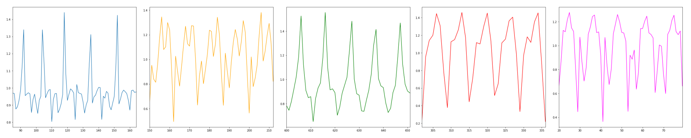

# Tracking Barbell Exercises
*Master Project | Abhijeet Thombare | IIT, Guwahati- DS AI, India*

This repository provides all the code to process, visualize, and classify accelerometer and gyroscope data obtained from fitbit smart band. The data was collected during gym workouts where participants were performing various barbell exercises.

#### Exercises

#### Goals
* Classify barbell exercises
* Count repetitions
* Detect improper form 

#### Installation
Create and activate an anaconda environment and install all package versions using `conda install --name <EnvironmentName> --file conda_requirements.txt`. Install non-conda packages using pip: `pip install -r pip_requirements.txt`.

#### References
The original code is associated with the book titled "*Machine Learning for the Quantified Self: On the Art of Learning from Sensory Data*"
authored by Mark Hoogendoorn and Burkhardt Funk and published by Springer in 2017. The website of the book can be found on [ml4qs.org](https://ml4qs.org/).

> Project: Tracking Barbell Exercises using ML on Sensor Data [ Master Project | Abhijeet Thombare | IIT Guwahati Feb 2025 ]  
> Built a fitness tracker model using time-series sensor data to classify different barbell exercises. Includes preprocessing, feature extraction, and supervised learning models.  

— Abhijeet Thombare [ abhithombare45 ] 

